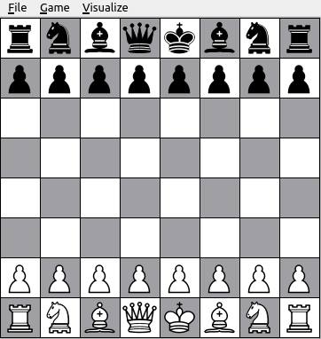

# Chess Engine

Welcome to my Chess Engine project! This is a simple chess game developed as part of my first-year Computer Science coursework. The game allows you to move pieces across the board using the mouse, and it provides a basic implementation of the rules of chess.

## Features
- **Move pieces:** Move chess pieces across the board following the rules of chess.
- **Undo/Redo moves**
- **Visualisation options:**
  - show valid moves
  - show player's threats
  - show enemy's threats

## Prerequisites
To run this project, you need to have the following software installed:

- **Qt5**: This project is built using the Qt5 framework, so you'll need to have it installed on your system.

## Attribution Requirement

If you use or copy any part of this project, please ensure to give proper credit by mentioning my name. 
Any form of plagiarism is not allowed.

## To be implemented:
- Calling UNDO/REDO on a promotion or En Passant move
- Loading and saving chess positions

